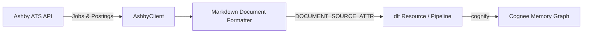

# Cognee Ashby Data-Source Connector

A community data-source connector integrating **[Ashby](https://ashbyhq.com)** with [Cognee](https://github.com/topoteretes/cognee)—the open-source memory layer for AI agents.

Ashby is the modern Applicant Tracking System (ATS) of choice for fast-growing technology leaders and AI startups (OpenAI, Figma, Ramp, Linear, Notion). This connector extracts job requisitions, published job postings, department competencies, and role requirements directly into Cognee's entity extraction and knowledge graph pipeline.



## Features

- **Document-Mode Ingestion**: Declares `DOCUMENT_SOURCE_ATTR = "ashby"`, converting recruiting requisitions and job descriptions into structured Markdown documents for knowledge graph entity extraction.
- **Candidate Privacy Safeguard**: Candidate contact PII is omitted during ingestion. Interview scorecards are strictly gated behind opt-in to safeguard confidential candidate reviews.
- **HTML Cleanup**: Automatically strips HTML tags and normalizes rich-text descriptions into clean Markdown.
- **Incremental Sync**: High-watermark tracking on `updatedAt` stored in `dlt` resource state (`last_updated_after`).
- **Forget-on-Delete**: Snapshot mode (`write_disposition="replace"`) ensures closed or archived job requisitions are purged from Cognee storage via `orphan_cleanup`.
- **Production Resilience**: Cursor-based pagination with exponential backoff on HTTP 429 (`Retry-After`) and 5xx errors.

## Installation

```bash
pip install cognee-community-connector-ashby
```

## Quick Start

```python
import asyncio
import os
import cognee
from cognee_community_connector_ashby import ashby_source


async def main():
    source = ashby_source(
        api_key=os.getenv("ASHBY_API_KEY"),
        status_filter="Open",
    )
    await cognee.add(source)
    await cognee.cognify()
    results = await cognee.search("What are the requirements for our Engineering roles?")
    print(results)


if __name__ == "__main__":
    asyncio.run(main())
```

## Configuration

| Parameter | Type | Default | Description |
| :--- | :---: | :---: | :--- |
| `api_key` | `str` | `env(ASHBY_API_KEY)` | Ashby API key |
| `base_url` | `str` | `"https://api.ashbyhq.com"` | Ashby API base URL |
| `status_filter` | `str` | `"Open"` | Job status to ingest (`Open`, `Draft`, `Closed`, `Archived`) |
| `include_job_postings` | `bool` | `True` | Whether to fetch published job post descriptions |
| `incremental` | `bool` | `False` | Enable incremental sync via cursor watermark |

## Running Tests

```bash
pytest packages/connector/ashby/tests/test_ashby.py -v
```
