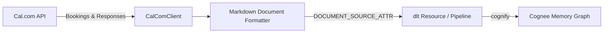

# Cognee Cal.com Data-Source Connector

A community data-source connector integrating **[Cal.com](https://cal.com)** with [Cognee](https://github.com/topoteretes/cognee)—the open-source memory layer for AI agents.

Cal.com is the leading open-source scheduling infrastructure platform (40k+ GitHub stars). This connector extracts scheduled bookings, event types, attendee notes, and custom questionnaire responses directly into Cognee's entity extraction and knowledge graph pipeline.



## Features

- **Document-Mode Ingestion**: Declares `DOCUMENT_SOURCE_ATTR = "calcom"`, converting scheduled meetings, attendee notes, and custom form inputs into structured Markdown documents for knowledge graph entity extraction.
- **Rich Context Capture**: Ingests custom booking questions and responses (e.g. project goals, agendas) alongside host and attendee details.
- **Incremental Sync**: High-watermark tracking on `updatedAt` / `startTime` stored in `dlt` resource state (`last_updated_after`).
- **Forget-on-Delete**: Snapshot mode (`write_disposition="replace"`) ensures cancelled or deleted meetings are purged from Cognee storage via `orphan_cleanup`.
- **Production Resilience**: Multi-page pagination with exponential backoff on HTTP 429 (`Retry-After`) and server errors.

## Installation

```bash
pip install cognee-community-connector-calcom
```

## Quick Start

```python
import asyncio
import os
import cognee
from cognee_community_connector_calcom import calcom_source


async def main():
    source = calcom_source(
        api_key=os.getenv("CALCOM_API_KEY"),
        status_filter="ACCEPTED",
    )
    await cognee.add(source)
    await cognee.cognify()
    results = await cognee.search("What did the client discuss in their onboarding call?")
    print(results)


if __name__ == "__main__":
    asyncio.run(main())
```

## Configuration

| Parameter | Type | Default | Description |
| :--- | :---: | :---: | :--- |
| `api_key` | `str` | `env(CALCOM_API_KEY)` | Cal.com API key |
| `base_url` | `str` | `"https://api.cal.com/v1"` | Cal.com API base URL (supports self-hosted) |
| `status_filter` | `str` | `"ACCEPTED"` | Status to ingest (`ACCEPTED`, `CANCELLED`, etc.) |
| `incremental` | `bool` | `False` | Enable incremental sync via cursor watermark |
| `page_size` | `int` | `100` | Number of bookings fetched per page |

## Running Tests

```bash
pytest packages/connector/calcom/tests/test_calcom.py -v
```
