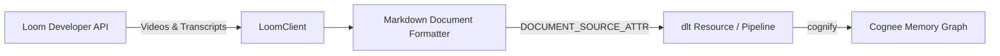

# Cognee Loom Data-Source Connector

A community data-source connector integrating **[Loom](https://loom.com)** with [Cognee](https://github.com/topoteretes/cognee)—the open-source memory layer for AI agents.

Loom is the leading asynchronous video messaging tool for distributed engineering and product teams. This connector ingests video recordings, AI-generated chapter breakdowns, summaries, and timestamped speech-to-text transcripts directly into Cognee's entity extraction and knowledge graph pipeline.



## Features

- **Document-Mode Ingestion**: Declares `DOCUMENT_SOURCE_ATTR = "loom"`, converting spoken video transcripts, chapters, and descriptions into structured Markdown documents for knowledge graph entity extraction.
- **Timestamped Speaker Segments**: Formats speech segments with speaker names and timestamps (e.g. `**[01:15] Alice**: ...`).
- **AI Chapters & Summaries**: Ingests high-level AI-generated summaries and topic chapters.
- **Incremental Sync**: High-watermark tracking on `updated_at` / `created_at` stored in `dlt` resource state (`last_updated_after`).
- **Forget-on-Delete**: Snapshot mode (`write_disposition="replace"`) ensures deleted or unshared video transcripts are purged from Cognee storage via `orphan_cleanup`.
- **Production Resilience**: Cursor-based pagination with exponential backoff on HTTP 429 (`Retry-After`) and 5xx errors.

## Installation

```bash
pip install cognee-community-connector-loom
```

## Quick Start

```python
import asyncio
import os
import cognee
from cognee_community_connector_loom import loom_source


async def main():
    source = loom_source(
        api_token=os.getenv("LOOM_API_TOKEN"),
        fetch_transcripts=True,
    )
    await cognee.add(source)
    await cognee.cognify()
    results = await cognee.search("What was explained in the checkout service demo?")
    print(results)


if __name__ == "__main__":
    asyncio.run(main())
```

## Configuration

| Parameter | Type | Default | Description |
| :--- | :---: | :---: | :--- |
| `api_token` | `str` | `env(LOOM_API_TOKEN)` | Loom Developer API token |
| `base_url` | `str` | `"https://api.loom.com/v1"` | Loom API base URL |
| `fetch_transcripts` | `bool` | `True` | Whether to fetch full spoken transcripts |
| `incremental` | `bool` | `False` | Enable incremental sync via cursor watermark |
| `limit` | `int` | `50` | Videos fetched per page |

## Running Tests

```bash
pytest packages/connector/loom/tests/test_loom.py -v
```
