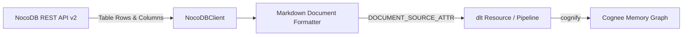

# Cognee NocoDB Data-Source Connector

A community data-source connector integrating **[NocoDB](https://nocodb.com)** with [Cognee](https://github.com/topoteretes/cognee)—the open-source memory layer for AI agents.

NocoDB is the leading open-source smart spreadsheet and no-code database platform (46,000+ GitHub stars). This connector extracts relational table schemas, row fields, and values directly into Cognee's entity extraction and knowledge graph pipeline.



## Features

- **Document-Mode Ingestion**: Declares `DOCUMENT_SOURCE_ATTR = "nocodb"`, converting relational database rows into structured Markdown entity documents for knowledge graph extraction.
- **Relational Field Extraction**: Extracts dynamic table fields, cell values, and timestamps without hardcoded schemas.
- **Incremental Sync**: High-watermark tracking on `UpdatedAt` stored in `dlt` resource state (`last_updated_after`) using NocoDB's `where` filter syntax.
- **Forget-on-Delete**: Snapshot mode (`write_disposition="replace"`) ensures deleted or archived database rows are purged from Cognee storage via `orphan_cleanup`.
- **Production Resilience**: Offset/limit pagination with exponential backoff on HTTP 429 (`Retry-After`) and 5xx errors.

## Installation

```bash
pip install cognee-community-connector-nocodb
```

## Quick Start

```python
import asyncio
import os
import cognee
from cognee_community_connector_nocodb import nocodb_source


async def main():
    source = nocodb_source(
        table_ids=["table_suppliers"],
        api_token=os.getenv("NOCODB_API_TOKEN"),
        base_url=os.getenv("NOCODB_BASE_URL", "http://localhost:8080"),
    )
    await cognee.add(source)
    await cognee.cognify()
    results = await cognee.search("Which suppliers handle international shipping?")
    print(results)


if __name__ == "__main__":
    asyncio.run(main())
```

## Configuration

| Parameter | Type | Default | Description |
| :--- | :---: | :---: | :--- |
| `table_ids` | `list[str] \| str` | `"table_default"` | Table ID(s) to fetch records from |
| `api_token` | `str` | `env(NOCODB_API_TOKEN)` | NocoDB API token (`xc-token`) |
| `base_url` | `str` | `"http://localhost:8080"` | NocoDB instance base URL |
| `incremental` | `bool` | `False` | Enable incremental sync via cursor watermark |
| `page_size` | `int` | `100` | Number of records fetched per page |

## Running Tests

```bash
pytest packages/connector/nocodb/tests/test_nocodb.py -v
```
