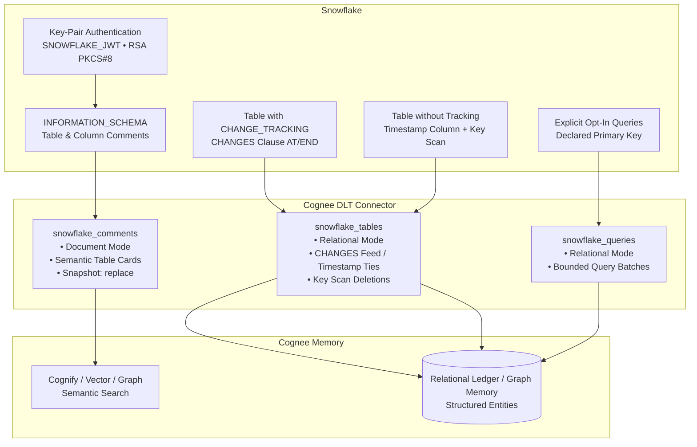

# Cognee Snowflake Connector

Data-source connector for **Snowflake** in [cognee](https://github.com/topoteretes/cognee).

The connector uses a **dual-path architecture** to ingest both high-level semantic context (table and column descriptions) and structured table data into Cognee's memory graph.

---

## Architecture Overview



---

## Key Features

1. **Dual Ingestion Paths**:
   - **`snowflake_comments` (Document Mode)**: Ingests `INFORMATION_SCHEMA.TABLES` and `COLUMNS` comments formatted as Markdown cards. Flows through Cognee's standard text chunking and LLM graph extraction, allowing users to ask natural-language questions like *"Which table tracks customer subscriptions?"*.
   - **`snowflake_tables` (Relational Mode)**: Ingests structured rows into Cognee's relational ledger with stable IDs (`snowflake:{account}:{database}.{schema}.{table}:{id}`).
   - **`snowflake_queries` (Relational Mode)**: Executes explicitly declared read-only queries. **Arbitrary SQL found inside metadata is never executed.**

2. **Zero-Stream Deletion & Update Feed (`CHANGES` Clause)**:
   - For tables with `CHANGE_TRACKING = TRUE`, the connector queries Snowflake's native `CHANGES(INFORMATION => DEFAULT)` clause.
   - Accurately captures `INSERT`, `UPDATE`, and `DELETE` without requiring stream objects.
   - If time travel retention expires, the connector automatically falls back to an authoritative full reconcile and establishes a fresh checkpoint.

3. **Robust Timestamp Fallback & Tie Handling**:
   - For tables without change tracking, syncs incrementally using a timestamp column (`cursor_column`).
   - Tracks `keys_seen_at_cursor` to prevent missed rows when multiple updates share identical microsecond timestamps.

4. **Anti-Corruption Deletion Guardrails**:
   - Deletions in timestamp mode are reconciled via a full primary-key scan.
   - **Safety Rule**: If a warehouse times out, a network glitch occurs, or permissions are revoked, **deletion reconciliation is immediately aborted** and no tombstones are emitted. Temporary upstream errors never wipe valid Cognee knowledge.

5. **Key-Pair Authentication**:
   - Uses `authenticator="SNOWFLAKE_JWT"` with RSA PKCS#8 private keys (encrypted or unencrypted).
   - Enforces `STATEMENT_QUEUED_TIMEOUT_IN_SECONDS` so suspended warehouses fail fast with clear diagnostics instead of hanging.

---

## Snowflake Setup

### 1. Generate an RSA Key Pair

Generate an encrypted 2048-bit PKCS#8 private key:

```bash
# Generate private key
openssl genrsa 2048 | openssl pkcs8 -topk8 -inform PEM -out rsa_key.p8 -v2 aes-256-cbc

# Generate public key
openssl rsa -in rsa_key.p8 -pubout -out rsa_key.pub
```

### 2. Register Public Key on Snowflake User

In Snowflake SQL (as `SECURITYADMIN` or user administrator):

```sql
-- Strip the BEGIN/END headers and line breaks from rsa_key.pub, then set:
ALTER USER COGNEE_USER SET RSA_PUBLIC_KEY='MIIBIjANBgkqhkiG9w0BAQEFAAOCAQ8AMIIBCgKCAQEA...';
```

*(Optional: Snowflake also supports named key pairs with expiration via `RSA_PUBLIC_KEY_2`).*

### 3. Grant Privileges

```sql
GRANT USAGE ON WAREHOUSE COMPUTE_WH TO ROLE ANALYST_ROLE;
GRANT USAGE ON DATABASE ANALYTICS TO ROLE ANALYST_ROLE;
GRANT USAGE ON SCHEMA ANALYTICS.PUBLIC TO ROLE ANALYST_ROLE;
GRANT SELECT ON ALL TABLES IN SCHEMA ANALYTICS.PUBLIC TO ROLE ANALYST_ROLE;
GRANT SELECT ON ALL VIEWS IN SCHEMA ANALYTICS.PUBLIC TO ROLE ANALYST_ROLE;

-- Make sure the warehouse auto-resumes when queries run
ALTER WAREHOUSE COMPUTE_WH SET AUTO_RESUME = TRUE;
```

### 4. (Recommended) Enable Change Tracking

To allow streamless inserts, updates, and deletes via the `CHANGES` clause:

```sql
ALTER TABLE ANALYTICS.PUBLIC.CUSTOMERS SET CHANGE_TRACKING = TRUE;
```

---

## Configuration & Environment Variables

| Variable | Description |
|---|---|
| `SNOWFLAKE_ACCOUNT` | Account identifier (e.g., `xy12345.us-east-1` or `orgname-account`) |
| `SNOWFLAKE_USER` | Snowflake username |
| `SNOWFLAKE_PRIVATE_KEY_FILE` | Path to `.p8` or `.pem` private key file |
| `SNOWFLAKE_PRIVATE_KEY_PEM` | In-memory PEM string (alternative to key file) |
| `SNOWFLAKE_PRIVATE_KEY_PASSPHRASE` | Passphrase if private key is encrypted |
| `SNOWFLAKE_WAREHOUSE` | Compute warehouse name |
| `SNOWFLAKE_DATABASE` | Target database name |
| `SNOWFLAKE_SCHEMA` | Target schema name (defaults to `PUBLIC`) |
| `SNOWFLAKE_ROLE` | Optional Snowflake role |

---

## Quickstart Example

```python
import asyncio
import cognee
from cognee_community_connector_snowflake import snowflake_source


async def main():
    source = snowflake_source(
        account="xy12345.us-east-1",
        user="COGNEE_USER",
        private_key_file="rsa_key.p8",
        warehouse="COMPUTE_WH",
        database="ANALYTICS",
        schema="PUBLIC",
        tables=[
            {
                "database": "ANALYTICS",
                "schema": "PUBLIC",
                "table": "CUSTOMERS",
                "primary_key": "CUSTOMER_ID",
                "use_changes": True,
                "cursor_column": "UPDATED_AT",
            }
        ],
        queries=[
            {
                "name": "enterprise_accounts",
                "sql": "SELECT CUSTOMER_ID, NAME FROM ANALYTICS.PUBLIC.CUSTOMERS WHERE TIER = 'ENTERPRISE'",
                "primary_key": "CUSTOMER_ID",
            }
        ],
        include_comments=True,
    )

    # Ingest and build knowledge graph
    await cognee.add(source)
    await cognee.cognify()

    # Search
    results = await cognee.search("Which table contains customer tiers?")
    for res in results:
        print(res)


if __name__ == "__main__":
    asyncio.run(main())
```
