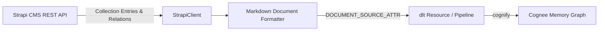

# Cognee Strapi Data-Source Connector

A community data-source connector integrating **[Strapi](https://strapi.io)** with [Cognee](https://github.com/topoteretes/cognee)—the open-source memory layer for AI agents.

Strapi is the leading open-source headless CMS (65,000+ GitHub stars). This connector extracts published CMS content collection entries, rich-text markdown blocks, authors, categories, and documentation pages directly into Cognee's entity extraction and knowledge graph pipeline.



## Features

- **Document-Mode Ingestion**: Declares `DOCUMENT_SOURCE_ATTR = "strapi"`, converting CMS articles, documentation, and blog posts into structured Markdown documents for knowledge graph entity extraction.
- **Relational Metadata**: Ingests associated author names, category tags, published dates, and custom fields.
- **Strapi v4 & v5 Compatibility**: Automatically normalizes both v4 wrapped attributes (`attributes`) and v5 flat schema payloads.
- **Incremental Sync**: High-watermark tracking on `updatedAt` stored in `dlt` resource state (`last_updated_after`) using Strapi's `filters[updatedAt][$gt]` parameter.
- **Forget-on-Delete**: Snapshot mode (`write_disposition="replace"`) ensures unpublished or deleted articles are purged from Cognee storage via `orphan_cleanup`.
- **Production Resilience**: Page-based pagination with exponential backoff on HTTP 429 (`Retry-After`) and 5xx errors.

## Installation

```bash
pip install cognee-community-connector-strapi
```

## Quick Start

```python
import asyncio
import os
import cognee
from cognee_community_connector_strapi import strapi_source


async def main():
    source = strapi_source(
        content_types=["articles", "documentation"],
        api_token=os.getenv("STRAPI_API_TOKEN"),
        base_url=os.getenv("STRAPI_BASE_URL", "http://localhost:1337"),
    )
    await cognee.add(source)
    await cognee.cognify()
    results = await cognee.search("What are the release notes for version 2.0?")
    print(results)


if __name__ == "__main__":
    asyncio.run(main())
```

## Configuration

| Parameter | Type | Default | Description |
| :--- | :---: | :---: | :--- |
| `content_types` | `list[str] \| str` | `"articles"` | Strapi collection types to fetch |
| `api_token` | `str` | `env(STRAPI_API_TOKEN)` | Read-only Strapi API Token |
| `base_url` | `str` | `"http://localhost:1337"` | Base URL of Strapi instance |
| `incremental` | `bool` | `False` | Enable incremental sync via cursor watermark |
| `page_size` | `int` | `100` | Number of entries fetched per page |

## Running Tests

```bash
pytest packages/connector/strapi/tests/test_strapi.py -v
```
